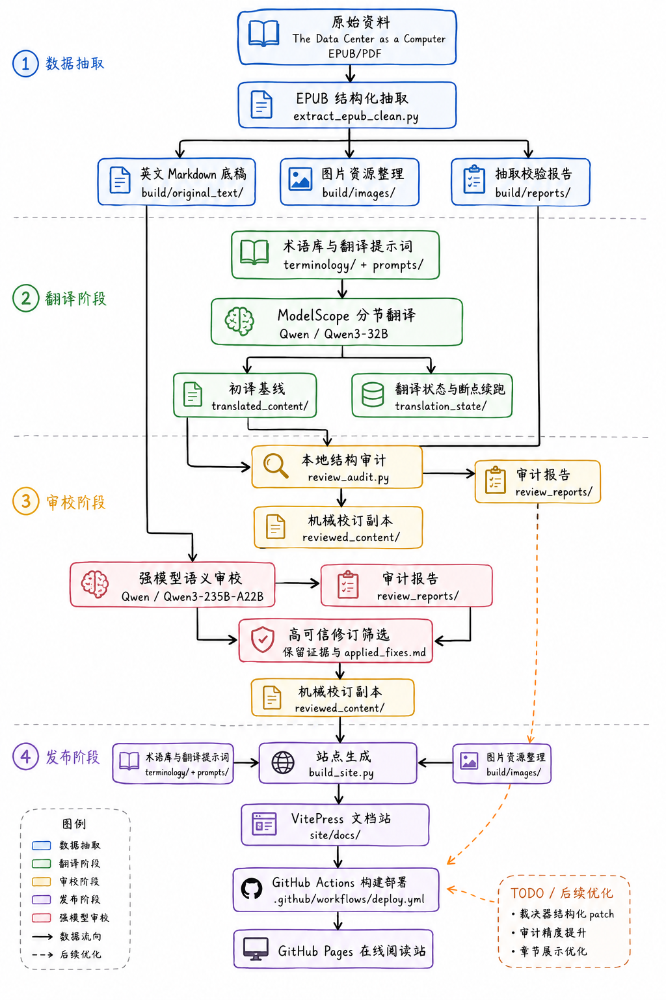

# data-center-as-a-computer-cn-translation

《The Data Center as a Computer》中文译文整理项目。

当前仓库主要包含两部分：

- `reviewed_content/`：二阶段校订稿，作为当前正文基线
- `site/`：基于 VitePress 的 GitHub Pages 站点工程

## 项目流程



## 本地预览站点

进入 `site/` 后执行：

```powershell
npm install
npm run docs:dev
```

构建静态站点：

```powershell
npm run docs:build
```

## GitHub Pages

仓库根目录下的 `.github/workflows/deploy.yml` 会在 `main` 分支 push 后自动构建并部署站点。

站点内容由下列输入自动生成：

- `reviewed_content/`
- `build/images/`
- `terminology/terms.csv`

重新生成站点正文：

```powershell
python build_site.py
```

## 说明

本仓库内容主要用于个人学习、技术阅读整理与译文校对。
